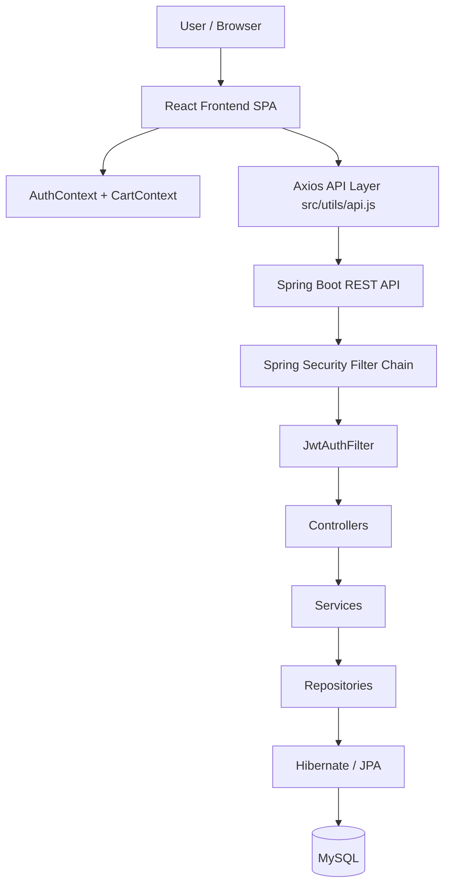
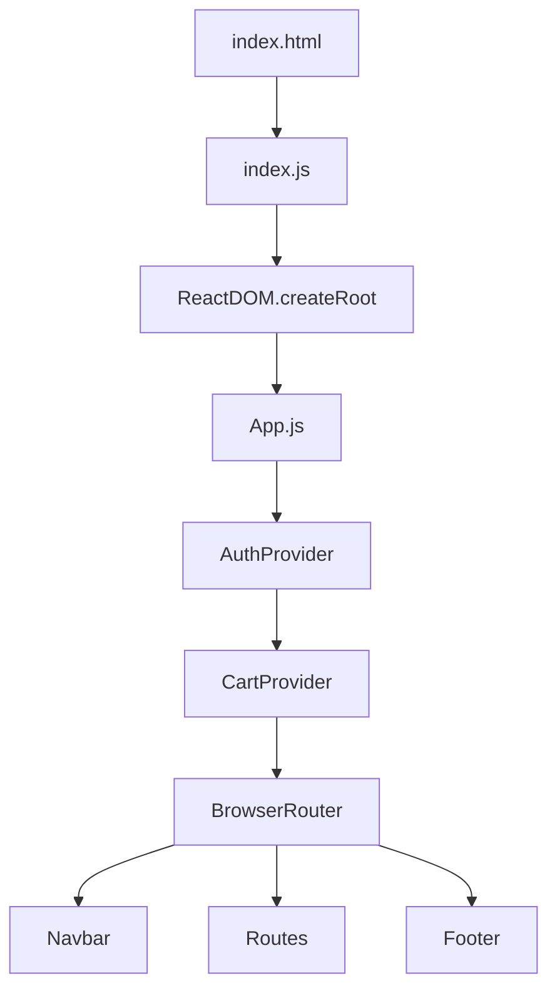
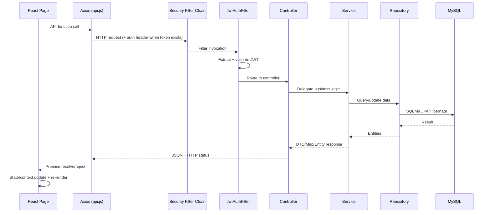
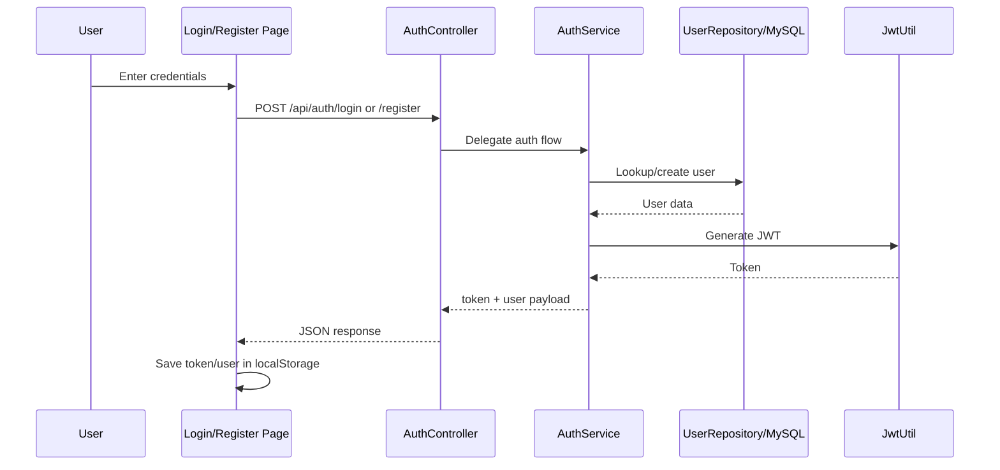
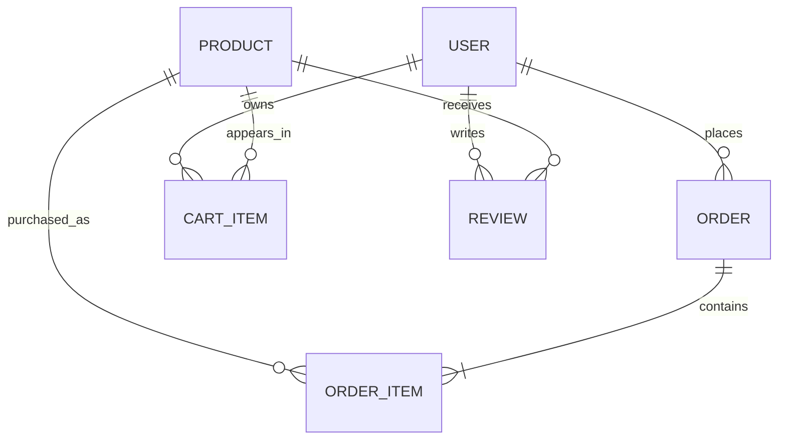
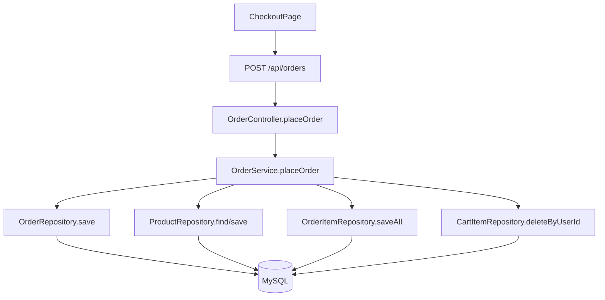

# 🛒 Shoply — Full-Stack E-commerce Application

Shoply is a full-stack e-commerce application with a React frontend and a Spring Boot backend. It covers core shopping journeys: account creation, login, product discovery, cart management, checkout, and order history.

The project is designed as a layered web application:
- **Frontend (React SPA)** handles UI, routing, and client-side state.
- **Backend (Spring Boot REST API)** handles authentication, business logic, and persistence.
- **Database (MySQL + JPA/Hibernate)** stores users, products, carts, orders, and reviews.

> The codebase is intentionally practical and interview-friendly: clear layers, JWT auth, role-aware endpoints, and readable workflows.

---

## 📑 Table of Contents

1. [Project Overview](#-project-overview)
2. [Architecture Overview](#-architecture-overview)
3. [Complete Application Workflow](#-complete-application-workflow)
4. [Application Startup Workflow](#-application-startup-workflow)
5. [Detailed Project Structure](#-detailed-project-structure)
6. [Frontend Architecture](#-frontend-architecture)
7. [Backend Architecture](#-backend-architecture)
8. [Request Lifecycle](#-request-lifecycle)
9. [Authentication & Authorization Workflow](#-authentication--authorization-workflow)
10. [Feature-by-Feature Workflows](#-feature-by-feature-workflows)
11. [Database Architecture](#-database-architecture)
12. [Data Flow](#-data-flow)
13. [API Reference](#-api-reference)
14. [File Execution Order](#-file-execution-order)
15. [Technology Stack](#-technology-stack)
16. [Environment Configuration](#-environment-configuration)
17. [Local Development Setup](#-local-development-setup)
18. [Error Handling & Validation](#-error-handling--validation)
19. [Testing](#-testing)
20. [Workflow Diagrams](#-workflow-diagrams)
21. [Current Limitations](#-current-limitations)
22. [Future Improvements](#-future-improvements)
23. [Developer Workflow](#-developer-workflow)

---

## 🔍 Project Overview

### What this application is
Shoply is an Amazon-style shopping application where users can:
- Register and login
- Browse/search products
- Add products to cart
- Checkout and place orders
- View their order history

### Who it is for
- Developers learning full-stack architecture (React + Spring Boot + MySQL)
- Interview preparation for layered backend design and JWT authentication
- Teams needing a starter e-commerce foundation

### Architectural characteristics
- **Stateless JWT security** in Spring Security filter chain
- **Layered backend**: Controller → Service → Repository → JPA/Hibernate
- **Context-based frontend state** for auth and cart
- **Hybrid cart behavior**: client-side cart context is primary in current UI, while server-side cart APIs also exist

---

## 🏗️ Architecture Overview



### Backend layering
```text
Controller
   ↓
Service
   ↓
Repository
   ↓
Hibernate/JPA
   ↓
MySQL
```

---

## 🔄 Complete Application Workflow

1. Browser loads `frontend/public/index.html`.
2. `frontend/src/index.js` mounts React root and renders `<App />`.
3. `frontend/src/App.js` initializes:
   - `AuthProvider`
   - `CartProvider`
   - `BrowserRouter`
   - `Navbar`, route pages, `Footer`
4. User opens a page and performs an action (search, login, add to cart, checkout).
5. Page components call functions from `frontend/src/utils/api.js`.
6. Axios interceptor injects an authentication header when a token exists in `localStorage`.
7. Request reaches Spring Boot (`backend/src/main/java/com/amazon/AmazonCloneApplication.java`).
8. Security filter chain runs (`SecurityConfig` + `JwtAuthFilter`).
9. Matching controller handles request (`AuthController`, `ProductController`, `CartController`, `OrderController`).
10. Controller delegates business logic to service layer.
11. Services use repositories to query/update MySQL through JPA/Hibernate.
12. Response is serialized to JSON and sent back.
13. Frontend updates local/component/context state and React re-renders UI.

---

## ⚡ Application Startup Workflow

### Frontend Startup



1. Browser loads `frontend/public/index.html` with `<div id="root"></div>`.
2. `frontend/src/index.js` creates root and renders `<App />` inside `React.StrictMode`.
3. `frontend/src/App.js` wraps app in `AuthProvider` and `CartProvider`.
4. `BrowserRouter` matches URL to page components.
5. `Navbar` and `Footer` render globally; selected page renders in `<main>`.

### Backend Startup

1. JVM starts `AmazonCloneApplication.main()`.
2. `SpringApplication.run(...)` bootstraps the Spring context.
3. Component scan creates beans for config, controllers, services, repositories.
4. `application.properties` is loaded (server, datasource, JPA, JWT, logging).
5. MySQL datasource and HikariCP pool are initialized.
6. JPA/Hibernate initializes entity mappings and updates schema (`ddl-auto=update`).
7. `DataInitializer` (`CommandLineRunner`) seeds products if `products` table is empty.
8. `SecurityConfig` builds stateless security filter chain.
9. `JwtAuthFilter` is registered before `UsernamePasswordAuthenticationFilter`.
10. Embedded Tomcat starts on port `8080`.

> `backend/src/main/resources/data.sql` exists, but `spring.sql.init.mode=never` disables automatic SQL init in current config.

---

## 🗂️ Detailed Project Structure

```text
Shoply/
├── README.md
├── backend/
│   ├── pom.xml
│   └── src/main/
│       ├── java/com/amazon/
│       │   ├── AmazonCloneApplication.java
│       │   ├── config/
│       │   │   ├── DataInitializer.java
│       │   │   ├── JwtAuthFilter.java
│       │   │   ├── JwtUtil.java
│       │   │   └── SecurityConfig.java
│       │   ├── controller/
│       │   │   ├── AuthController.java
│       │   │   ├── CartController.java
│       │   │   ├── OrderController.java
│       │   │   └── ProductController.java
│       │   ├── model/
│       │   │   ├── CartItem.java
│       │   │   ├── Order.java
│       │   │   ├── OrderItem.java
│       │   │   ├── Product.java
│       │   │   ├── Review.java
│       │   │   └── User.java
│       │   ├── repository/
│       │   │   ├── CartItemRepository.java
│       │   │   ├── OrderItemRepository.java
│       │   │   ├── OrderRepository.java
│       │   │   ├── ProductRepository.java
│       │   │   ├── ReviewRepository.java
│       │   │   └── UserRepository.java
│       │   └── service/
│       │       ├── AuthService.java
│       │       ├── CartService.java
│       │       ├── OrderService.java
│       │       └── ProductService.java
│       └── resources/
│           ├── application.properties
│           └── data.sql
└── frontend/
    ├── package.json
    ├── package-lock.json
    ├── public/
    │   └── index.html
    └── src/
        ├── index.js
        ├── App.js
        ├── App.css
        ├── index.css
        ├── components/
        │   ├── Footer.js / Footer.css
        │   ├── Navbar.js / Navbar.css
        │   └── ProductCard.js / ProductCard.css
        ├── context/
        │   ├── AuthContext.js
        │   └── CartContext.js
        ├── pages/
        │   ├── AuthPages.css
        │   ├── CartPage.js / CartPage.css
        │   ├── CheckoutPage.js / CheckoutPage.css
        │   ├── HomePage.js / HomePage.css
        │   ├── LoginPage.js
        │   ├── OrdersPage.js / OrdersPage.css
        │   ├── ProductPage.js / ProductPage.css
        │   ├── RegisterPage.js
        │   └── SearchPage.js / SearchPage.css
        └── utils/
            └── api.js
```

---

## 🧩 Frontend Architecture

### Entry point and app shell
- `src/index.js`: mounts React app.
- `src/App.js`: builds provider and routing tree.

### Provider and route hierarchy
```text
App.js
 ├── AuthProvider
 │    └── CartProvider
 │         └── BrowserRouter
 │              ├── Navbar
 │              ├── Routes
 │              │    ├── /            -> HomePage
 │              │    ├── /product/:id -> ProductPage
 │              │    ├── /search      -> SearchPage
 │              │    ├── /cart        -> CartPage
 │              │    ├── /checkout    -> CheckoutPage
 │              │    ├── /orders      -> OrdersPage
 │              │    ├── /login       -> LoginPage
 │              │    └── /register    -> RegisterPage
 │              └── Footer
```

### State management
- **Auth state**: `AuthContext`
  - Holds `user`, `token`, `isLoggedIn`
  - Persists `user` and `token` in `localStorage`
  - Exposes `login()` and `logout()`
- **Cart state**: `CartContext`
  - Holds `cartItems`
  - Computes `cartCount`, `cartTotal`
  - Persists cart array in `localStorage`

### API layer
- `src/utils/api.js` creates Axios instance.
- `baseURL = REACT_APP_API_URL || http://localhost:8080/api`
- Request interceptor adds JWT bearer token from `localStorage`.
- Exposes API functions for auth/products/cart/orders.

### Page/component behavior
- `HomePage`, `SearchPage`, `ProductPage`, `OrdersPage` attempt API fetch and fallback to mock data when calls fail.
- `CartPage` and `CheckoutPage` primarily operate on `CartContext` state.
- `Navbar` reads auth/cart context for greeting, logout, and cart count.

---

## 🧱 Backend Architecture

### Layer responsibilities
- **Controller**: HTTP mapping, request extraction, status responses.
- **Service**: business rules, authorization checks, orchestration.
- **Repository**: DB access via Spring Data JPA.
- **Model/Entity**: table mapping and relationships.

### Configuration/Security
- `AmazonCloneApplication`: app bootstrap.
- `SecurityConfig`:
  - Stateless session policy.
  - Public routes: `/api/auth/**`, `/api/products/**`.
  - Authenticated routes: `/api/cart/**`, `/api/orders/**`.
  - Admin-only routes: `/api/admin/**` and method-level `@PreAuthorize` checks.
- `JwtAuthFilter`: parses and validates JWT, populates `SecurityContextHolder`.
- `JwtUtil`: token generation, claim extraction, expiration validation.
- `DataInitializer`: seeds default products if DB is empty.

### Controllers
- `AuthController`: register/login.
- `ProductController`: product read/search/filter + admin CRUD.
- `CartController`: authenticated cart operations.
- `OrderController`: place orders, fetch user orders, cancel, admin status update.

### Services
- `AuthService`: `UserDetailsService`, registration/login, BCrypt hash, JWT issuing.
- `ProductService`: search/filter/category/prime/product CRUD.
- `CartService`: add/update/remove/clear cart items with user ownership checks.
- `OrderService`: order creation, stock reduction, cart clearing, status updates, cancellation logic.

### Repositories
- `UserRepository`: email lookup, duplicate check.
- `ProductRepository`: custom JPQL search, category list, prime/max-price filters.
- `CartItemRepository`: user cart queries and deletes.
- `OrderRepository`: user/status order queries.
- `OrderItemRepository`: order line retrieval.
- `ReviewRepository`: review lookup/existence checks.

### Entities
- `User`: account + role + relationships.
- `Product`: catalog item with pricing, stock, prime flag.
- `CartItem`: user-product quantity row.
- `Order`: order header with status, shipping, payment, total.
- `OrderItem`: order line items (product snapshot price + qty).
- `Review`: product review model (entity exists; review API not yet implemented).

---

## 🔁 Request Lifecycle



### Failure path (common)
- Missing/invalid token on protected endpoints → request remains unauthenticated → Spring Security denies (401/403).
- Service runtime exceptions are caught in controllers and returned as error maps (`{"error":"..."}`) with status `400/401/403`.

---

## 🔐 Authentication & Authorization Workflow

### Registration
1. Frontend `RegisterPage` submits `{name,email,password}` to `POST /api/auth/register`.
2. `AuthController.register()` validates required fields + password length.
3. `AuthService.register()` checks duplicate email, hashes password (`BCryptPasswordEncoder`), saves user with `USER` role.
4. JWT is generated via `JwtUtil.generateToken(...)`.
5. Response includes `token` and minimal `user` payload (`id,name,email`).
6. Frontend stores both in `localStorage` via `AuthContext.login()`.

### Login
1. `LoginPage` submits `{email,password}` to `POST /api/auth/login`.
2. `AuthService.login()` authenticates through `AuthenticationManager` + `DaoAuthenticationProvider`.
3. `loadUserByUsername()` loads user from DB and grants `ROLE_<USER|ADMIN>` authority.
4. JWT is generated and returned with user summary.

### Authenticated request
1. Axios interceptor appends bearer token.
2. `JwtAuthFilter` extracts token subject (email), loads user details, validates token and expiration.
3. If valid, filter sets `SecurityContextHolder` authentication.
4. Controller can access authenticated principal via `@AuthenticationPrincipal UserDetails`.

### Authorization
- Public: `/api/auth/**`, `/api/products/**`
- Auth required: `/api/cart/**`, `/api/orders/**`
- Admin operations enforced with `@PreAuthorize("hasRole('ADMIN')")` on selected endpoints.

### Logout
`AuthContext.logout()` clears user/token from state + `localStorage`.



---

## 🧭 Feature-by-Feature Workflows

### 1) User registration
`RegisterPage` → `registerUser()` → `POST /api/auth/register` → `AuthController` → `AuthService.register` → `UserRepository.save` → JWT response → `AuthContext.login`.

### 2) User login
`LoginPage` → `loginUser()` → `POST /api/auth/login` → `AuthController` → `AuthService.login` + `AuthenticationManager` → JWT response → `AuthContext.login`.

### 3) Product browsing
`HomePage` → `getProducts()` → `GET /api/products` → `ProductController.getAllProducts` → `ProductService` → `ProductRepository.findAll`.

### 4) Product details
`ProductPage` → `getProduct(id)` → `GET /api/products/{id}` → `ProductController.getProduct`.

### 5) Product search
`SearchPage` (`?q=`) → `searchProducts(q)` → `GET /api/products/search?q=` → `ProductController.search` → `ProductRepository.searchProducts`.

### 6) Category filtering
Backend endpoint exists: `GET /api/products/category/{category}`.
Current frontend mainly uses search-query links (`/search?q=...`) rather than calling `getProductsByCategory()` from UI routes.

### 7) Cart operations
- **Current frontend primary flow**: `CartContext` + `localStorage` (`addToCart`, `removeFromCart`, `updateQuantity`, `clearCart`).
- **Backend cart APIs also implemented**: `/api/cart`, `/api/cart/add`, `/api/cart/{id}`, `/api/cart/clear`.

### 8) Checkout and order creation
`CheckoutPage` (context cart) → `placeOrder()` → `POST /api/orders` (auth required) → `OrderService.placeOrder`:
- Parses address/payment/items
- Creates `Order`
- Creates `OrderItem`s
- Reduces product stock (if sufficient)
- Updates total
- Clears DB cart for user

### 9) Order history
`OrdersPage` → `getOrders()` → `GET /api/orders` → `OrderService.getOrdersByUser` → `OrderRepository.findByUserIdOrderByCreatedAtDesc`.

### 10) Product administration
Admin-only:
- `POST /api/products`
- `PUT /api/products/{id}`
- `DELETE /api/products/{id}`

### 11) Reviews
`Review` entity/repository exist, but no review controller/service endpoints are exposed in current API.

---

## 🗄️ Database Architecture

### Database
- **Type**: MySQL
- **Configured DB name**: `shoply` (from datasource URL)

### Tables (from entities)
- `users`
- `products`
- `cart_items`
- `orders`
- `order_items`
- `reviews`

### Key constraints/relationships
- `users.email` unique.
- `cart_items.user_id` → `users.id`, `cart_items.product_id` → `products.id`.
- `orders.user_id` → `users.id`.
- `order_items.order_id` → `orders.id`, `order_items.product_id` → `products.id`.
- `reviews.user_id` → `users.id`, `reviews.product_id` → `products.id`.



### Seed data
- `DataInitializer` inserts 12 products only if product table is empty.
- `data.sql` contains insert statements but is disabled by current Spring SQL init config.

---

## 🌊 Data Flow

### Authentication flow
**Frontend**: Login/Register page → `api.js` → Axios interceptor/localStorage sync through `AuthContext`.

**Backend**: `AuthController` → `AuthService` → `UserRepository` + `PasswordEncoder` + `JwtUtil`.

### Product retrieval/search flow
**Frontend**: `HomePage`/`SearchPage`/`ProductPage` → `api.js`.

**Backend**: `ProductController` → `ProductService` → `ProductRepository`.

### Cart flow
**Frontend (current dominant)**: `ProductCard`/`ProductPage`/`CartPage` → `CartContext` → `localStorage`.

**Backend (available APIs)**: `CartController` → `CartService` → `CartItemRepository`.

### Checkout/orders flow
**Frontend**: `CheckoutPage` reads `CartContext` and submits order payload.

**Backend**: `OrderController` → `OrderService` → `OrderRepository` + `OrderItemRepository` + `ProductRepository` + `CartItemRepository`.

### Admin product ops flow
Admin client → `ProductController` (`@PreAuthorize`) → `ProductService` → `ProductRepository`.

---

## 📡 API Reference

### Authentication

| Method | Endpoint | Authentication | Role | Purpose |
|---|---|---|---|---|
| POST | `/api/auth/register` | Public | Any | Register user and return JWT + user summary |
| POST | `/api/auth/login` | Public | Any | Login and return JWT + user summary |

- **Register body**: `{ "name": "...", "email": "...", "password": "..." }`
- **Login body**: `{ "email": "...", "password": "..." }`
- **Success response**: `{ "token": "...", "user": { "id": ..., "name": "...", "email": "..." } }`
- **Common errors**: `400`, `401`

### Products

| Method | Endpoint | Authentication | Role | Purpose |
|---|---|---|---|---|
| GET | `/api/products` | Public | Any | List all products |
| GET | `/api/products/{id}` | Public | Any | Get one product |
| GET | `/api/products/search?q=` | Public | Any | Search name/description/category/brand |
| GET | `/api/products/category/{category}` | Public | Any | Filter by category |
| GET | `/api/products/prime` | Public | Any | Prime products |
| GET | `/api/products/categories` | Public | Any | Distinct categories |
| GET | `/api/products/filter?maxPrice=` | Public | Any | Max-price filter |
| POST | `/api/products` | JWT | ADMIN | Create product |
| PUT | `/api/products/{id}` | JWT | ADMIN | Update product |
| DELETE | `/api/products/{id}` | JWT | ADMIN | Delete product |

### Cart

| Method | Endpoint | Authentication | Role | Purpose |
|---|---|---|---|---|
| GET | `/api/cart` | JWT | USER/ADMIN | Get current user cart items |
| POST | `/api/cart/add` | JWT | USER/ADMIN | Add/increment cart item |
| PUT | `/api/cart/{id}` | JWT | USER/ADMIN | Update cart item quantity (<=0 removes) |
| DELETE | `/api/cart/{id}` | JWT | USER/ADMIN | Remove single cart item |
| DELETE | `/api/cart/clear` | JWT | USER/ADMIN | Clear user cart |

- **Add body**: `{ "productId": 1, "quantity": 2 }`
- **Update body**: `{ "quantity": 3 }`

### Orders

| Method | Endpoint | Authentication | Role | Purpose |
|---|---|---|---|---|
| GET | `/api/orders` | JWT | USER/ADMIN | Get current user orders |
| GET | `/api/orders/{id}` | JWT | USER/ADMIN | Get one order (owner only) |
| POST | `/api/orders` | JWT | USER/ADMIN | Place order from provided items/address/payment |
| POST | `/api/orders/{id}/cancel` | JWT | USER/ADMIN | Cancel own order (not delivered) |
| PUT | `/api/orders/{id}/status` | JWT | ADMIN | Update order status |

- **Place order body** (current frontend):
  ```json
  {
    "items": [{ "id": 1, "name": "...", "price": 100, "quantity": 1 }],
    "address": { "name": "...", "phone": "...", "line1": "...", "line2": "...", "city": "...", "state": "...", "pincode": "..." },
    "payment": { "method": "cod" },
    "total": 123
  }
  ```
- **Place order response**: `{ "id": <orderId>, "status": "PROCESSING", "total": <amount>, "message": "Order placed successfully!" }`

---

## 📂 File Execution Order

### Frontend Execution Order

1. `frontend/public/index.html`
2. `frontend/src/index.js`
3. `frontend/src/App.js`
4. `frontend/src/context/AuthContext.js`
5. `frontend/src/context/CartContext.js`
6. Router route match (`react-router-dom`)
7. Page component (`HomePage`, `ProductPage`, etc.)
8. API call (`frontend/src/utils/api.js`) if needed
9. Shared components (`Navbar`, `ProductCard`, `Footer`)
10. State update → UI re-render

### Backend Execution Order

1. `backend/src/main/java/com/amazon/AmazonCloneApplication.java`
2. Spring Boot auto-configuration and component scan
3. `application.properties` load
4. Datasource + JPA/Hibernate initialization
5. `DataInitializer.run(...)` (if products table empty)
6. `SecurityConfig.securityFilterChain(...)`
7. `JwtAuthFilter` attached in filter chain
8. Request routing to controller
9. Service execution
10. Repository/JPA query
11. Entity/Map serialization to JSON response

---

## 🚀 Technology Stack

| Layer | Technologies actually used |
|---|---|
| Frontend | React 18, React Router DOM 6, Axios, CSS |
| Backend | Java 17, Spring Boot 3.2.0, Spring Web, Spring Security, Spring Data JPA, Spring Validation |
| Auth | JWT (`jjwt` 0.11.5), BCrypt password hashing |
| Database | MySQL + Hibernate/JPA |
| Build tools | Maven (backend), npm/react-scripts (frontend) |
| Utilities | Lombok, Spring Boot DevTools |
| Testing libs present | `spring-boot-starter-test` (backend dependency) |

---

## 🌐 Environment Configuration

### Backend (`backend/src/main/resources/application.properties`)

Use safe local values (do **not** commit secrets):

```properties
server.port=8080
spring.datasource.url=jdbc:mysql://localhost:3306/<your-database>?useSSL=false&serverTimezone=UTC&allowPublicKeyRetrieval=true
spring.datasource.username=<your-db-user>
spring.datasource.******
spring.datasource.driver-class-name=com.mysql.cj.jdbc.Driver

spring.jpa.database-platform=org.hibernate.dialect.MySQLDialect
spring.jpa.hibernate.ddl-auto=update
spring.jpa.show-sql=true

app.jwt.secret=<your-long-random-jwt-secret>
app.jwt.expiration=86400000
```

Other active settings:
- `spring.sql.init.mode=never` (disables automatic `data.sql` execution)
- `spring.main.allow-circular-references=true`
- CORS allowed origin configured as `http://localhost:3000` in `SecurityConfig`

### Frontend
Optional `.env` in `frontend/`:

```env
REACT_APP_API_URL=http://localhost:8080/api
```

If not set, frontend defaults to `http://localhost:8080/api`.

---

## 🛠️ Local Development Setup

### Prerequisites
- Java 17+
- Maven 3.8+
- Node.js 18+
- npm 9+
- MySQL 8+

### 1) Clone
```bash
git clone https://github.com/soham29640/Shoply.git
cd Shoply
```

### 2) Database setup
1. Start MySQL.
2. Create database:
   ```sql
   CREATE DATABASE shoply;
   ```
3. Update backend DB credentials in `backend/src/main/resources/application.properties`.

### 3) Run backend
```bash
cd backend
mvn spring-boot:run
```
Backend URL: `http://localhost:8080`

### 4) Run frontend
```bash
cd frontend
npm install
npm start
```
Frontend URL: `http://localhost:3000`

### Startup order recommendation
Start **backend first**, then frontend. This avoids frontend API errors during initial page load.

---

## ⚠️ Error Handling & Validation

### Backend validation style in current code
- Input checks are mostly **manual** in controllers/services.
- Errors are returned as JSON maps, e.g. `{ "error": "..." }`.
- Common status usage:
  - `400` bad request (validation/business failures)
  - `401` invalid login
  - `403` unauthorized order access/security denial
  - `404` product not found in some endpoints

### Security failures
Invalid/missing JWT on protected routes leads to authentication failure in Spring Security before service logic.

### Frontend error handling
Pages catch Axios errors and show fallback UI/messages (and in several pages fallback mock data).

### Exception/validation infrastructure status
- No global `@ControllerAdvice` exception handler currently.
- Validation annotations exist on entity fields (e.g., `@Email`, `@NotBlank`), but controller methods do not currently use DTO + `@Valid` request validation.

---

## 🧪 Testing

- No backend test source files are currently present under `backend/src/test`.
- No frontend test files are currently present.
- Testing dependencies exist (backend has `spring-boot-starter-test`), but tests are not yet implemented in this repository snapshot.

When tests are added later, they can typically be run with:
```bash
cd backend
mvn test
```

---

## 📊 Workflow Diagrams

### 1) Overall architecture
See [Architecture Overview](#-architecture-overview).

### 2) Application startup
See [Application Startup Workflow](#-application-startup-workflow).

### 3) Authentication
See [Authentication & Authorization Workflow](#-authentication--authorization-workflow).

### 4) Normal API request
See [Request Lifecycle](#-request-lifecycle).

### 5) Database interaction (order placement)


### 6) Checkout/order workflow
```mermaid
flowchart TD
    C[CartContext items] --> CH[CheckoutPage steps]
    CH -->|Address + Payment + Items| API[placeOrder()]
    API --> BE[POST /api/orders]
    BE --> ORD[Create Order + OrderItems]
    ORD --> STK[Reduce stock]
    ORD --> CLR[Clear DB cart]
    ORD --> RES[Return order summary]
    RES --> UI[Show success + clear client cart + navigate /orders]
```

---

## 🚧 Current Limitations

1. **Frontend cart and backend cart are not fully unified**
   - Main UI uses `CartContext` (`localStorage`) as source of truth.
   - Backend cart endpoints exist but are not the primary flow in current pages.

2. **No refresh-token mechanism**
   - JWT is single-token flow stored in localStorage.

3. **Limited centralized error handling**
   - No global exception handler/standard error model.

4. **Validation is mostly manual**
   - DTO-based `@Valid` validation pipeline is not yet in place.

5. **Tests are currently missing**
   - No committed unit/integration test classes.

6. **Security/config hardening is development-oriented**
   - CORS is fixed to localhost frontend.
   - Sensitive values should be externalized from source-controlled config.

7. **Review feature is data-model ready but API incomplete**
   - `Review` entity/repository exist, but no review controller/service endpoints.

---

## 🔮 Future Improvements

1. Replace manual request maps with DTOs + Bean Validation (`@Valid`).
2. Add global exception handling with consistent error response contract.
3. Unify cart strategy (server-side cart sync + context hydration from API).
4. Add refresh tokens and stronger token lifecycle management.
5. Add automated tests (service, controller, integration, and frontend component tests).
6. Add API documentation (OpenAPI/Swagger).
7. Externalize secrets fully via environment variables/secrets manager.
8. Add CI/CD pipelines and quality gates.
9. Add Docker/Docker Compose for reproducible local setup.
10. Implement full review/rating APIs and UI integration.

---

## 👩‍💻 Developer Workflow

```text
Clone repository
   ↓
Install frontend dependencies
   ↓
Create/configure MySQL database
   ↓
Set backend environment values
   ↓
Start Spring Boot backend (port 8080)
   ↓
Start React frontend (port 3000)
   ↓
Open browser and use app
   ↓
Iterate on feature/page/service/repository layers
```

Practical day-to-day workflow:
1. Start DB and backend.
2. Start frontend.
3. Build a feature end-to-end (page → api.js → controller → service → repository).
4. Verify auth and role behavior.
5. Add/extend tests once test suite is introduced.

---

If you are preparing for interviews, this repository is a good reference for discussing:
- JWT auth in Spring Security
- Layered architecture design
- React Context state management
- End-to-end request/data flow
- Tradeoffs between client-side and server-side cart persistence
